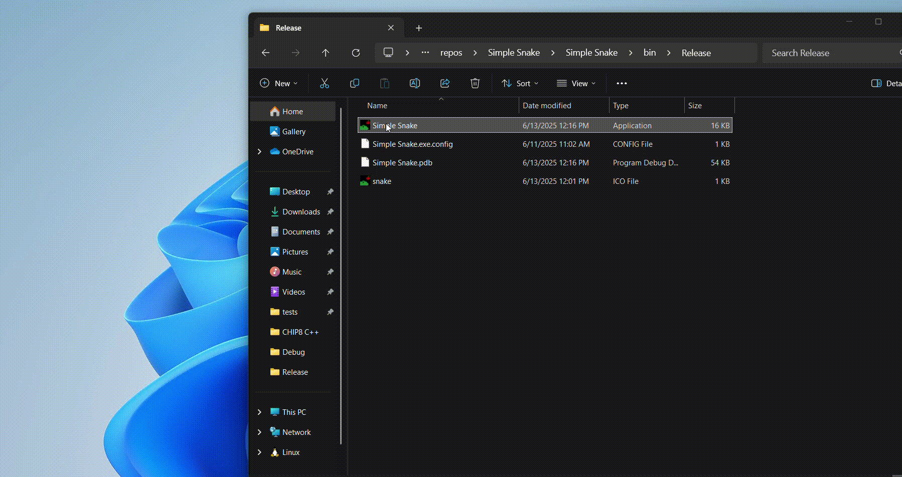

  <h1>CHIP8++</h1>
  
A simple rendition of Snake with endless random levels written in C# Windows Forms

  

# Controls

| Key        | Action   |
| ---------- | -------- |
| Arrow Keys | Movement |
| Esc        | Pause    |

# Features
- The essential rules that come with Snake
- Endless spree of levels where the objective is to get a certain amount of apples

# To Do
- Polishing the game itself
- Adding more UI
